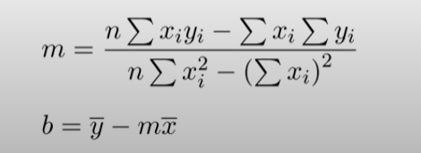

## 2️⃣ Regresión Lineal Simple (Predicción de variable dependiente) 

La regresión lineal simple es un método estadístico utilizado para modelar la relación entre una variable independiente (X) y una variable dependiente (Y) asumiendo una relación lineal entre ellas. La fórmula de la regresión lineal simple se puede expresar de la siguiente manera:

Y = β0 + β1X + ε

Donde:

- Y es la variable dependiente que estamos tratando de predecir.
- X es la variable independiente que se utiliza para hacer la predicción.
- β0 es la intersección (también conocida como el término de corte o constante) de la línea de regresión con el eje Y cuando X es igual a cero.
- β1 es la pendiente de la línea de regresión, que representa el cambio en Y por unidad de cambio en X.
- ε representa el error o residuo, que es la diferencia entre el valor real observado de Y y el valor predicho por el modelo. Los errores son asumidos como variables aleatorias con una media de cero.

El objetivo de la regresión lineal simple es encontrar los valores de β0 y β1 que minimicen la suma de los cuadrados de los residuos (mínimos cuadrados), lo que significa encontrar la línea de regresión que mejor se ajusta a los datos observados.

Una vez que se han estimado los valores de β0 y β1, se puede utilizar la ecuación de regresión para hacer predicciones de Y para valores dados de X.

En resumen, la fórmula de la regresión lineal simple es una representación matemática de la relación lineal entre una variable independiente y una variable dependiente, con el objetivo de modelar y predecir esta relación.

Formula para calcular pendiente e intersección:

